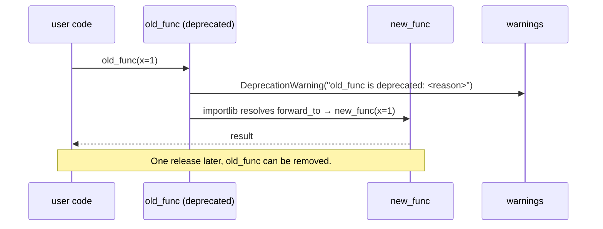

# scitex-compat

<p align="center">
  <a href="https://scitex.ai">
    
  </a>
</p>

<p align="center"><b>Backward compatibility shims and deprecation wrappers for the SciTeX ecosystem.</b></p>

<p align="center">
  <a href="https://scitex-compat.readthedocs.io/">Full Documentation</a> · <code>uv pip install scitex-compat[all]</code>
</p>

<!-- scitex-badges:start -->
<p align="center">
  <a href="https://pypi.org/project/scitex-compat/"></a>
  <a href="https://pypi.org/project/scitex-compat/"></a>
  <a href="https://github.com/ywatanabe1989/scitex-compat/actions/workflows/rtd-sphinx-build-on-ubuntu-latest.yml"></a>
</p>
<p align="center">
  <a href="https://github.com/ywatanabe1989/scitex-compat/actions/workflows/pytest-matrix-on-ubuntu-py3-11-3-12-3-13.yml"></a>
  <a href="https://github.com/ywatanabe1989/scitex-compat/actions/workflows/import-smoke-on-ubuntu-py3-12.yml"></a>
  <a href="https://codecov.io/gh/ywatanabe1989/scitex-compat"></a>
</p>
<!-- scitex-badges:end -->

---

> **Interfaces:** Python ⭐⭐⭐ (primary) · CLI — · MCP — · Skills ⭐ · Hook — · HTTP —

## Problem and Solution

| # | Problem | Solution |
|---|---------|----------|
| 1 | **Renaming a public API silently breaks users** — there's no stdlib way to say "this still works but is deprecated" | **`@deprecated` decorator** — emits `DeprecationWarning` with a `reason=` hint; optional `forward_to=` redirects the call to the replacement so old code-paths keep working transparently |
| 2 | **Migrating legacy `notify()` calls** — old scripts reference functions whose home moved | **Compat shims** — `notify`, `notify_async` still callable, forward to the new home, warn once |
| 3 | **Layer-0 leaves can't pull `numpy` just to mark an API deprecated** | scitex-compat has **zero runtime deps** (pure stdlib). It is the canonical home for `@deprecated` in the SciTeX ecosystem — see [ADR-0001](docs/adr/0001-canonical-deprecated-decorator.md) |

## Installation

```bash
pip install scitex-compat
```

## Architecture

`scitex-compat` is the **SSOT** (single source of truth) for the
`@deprecated` decorator across the SciTeX ecosystem. Other packages
(notably `scitex-decorators`) re-export from here, so there is exactly
one implementation to fix bugs in or extend.

```
scitex-compat/
├── src/scitex_compat/
│   ├── __init__.py              # deprecated, notify, notify_async
│   └── _compat.py               # @deprecated impl + notify/notify_async shims
├── docs/adr/
│   └── 0001-canonical-deprecated-decorator.md   # SSOT decision
└── tests/
```

See also: [`scitex-decorators` ADR-0001](https://github.com/ywatanabe1989/scitex-decorators/blob/develop/docs/adr/0001-thin-reexport-of-deprecated.md)
documenting the re-export contract from the other side.

## Quick Start

```python
from scitex_compat import deprecated

# 1. Warn-only form
@deprecated(reason="use new_function instead; removed in 3.0")
def old_function():
    pass

# 2. Forwarding form — redirects calls to the new location
@deprecated(reason="moved to scitex.session.start", forward_to="..session.start")
def start():
    pass
```

## 1 Interfaces

<details open>
<summary><strong>Python API</strong></summary>

<br>

```python
from scitex_compat import deprecated, notify, notify_async

# Warn-only: emits DeprecationWarning, still calls the wrapped body.
@deprecated(reason="use new_func instead")
def old_func(*args, **kwargs):
    ...

# Forwarding: warning + transparent redirect via importlib.
# forward_to may be absolute ("pkg.mod.func") or relative ("..mod.func")
# resolved against the decorated function's __module__.
@deprecated(reason="moved", forward_to="scitex_other.mod.replacement")
def renamed_func(*args, **kwargs):
    ...

# Compat shims (forward to scitex.notify if installed)
notify("hello")
await notify_async("hello")
```

</details>

## Demo



## Part of SciTeX

`scitex-compat` is part of [**SciTeX**](https://scitex.ai). Install via
the umbrella with `pip install scitex[compat]` to use as
`scitex.compat` (Python) or `scitex compat ...` (CLI).

>Four Freedoms for Research
>
>0. The freedom to **run** your research anywhere — your machine, your terms.
>1. The freedom to **study** how every step works — from raw data to final manuscript.
>2. The freedom to **redistribute** your workflows, not just your papers.
>3. The freedom to **modify** any module and share improvements with the community.
>
>AGPL-3.0 — because we believe research infrastructure deserves the same freedoms as the software it runs on.

## License

AGPL-3.0

---

<p align="center">
  <a href="https://scitex.ai" target="_blank"></a>
</p>
